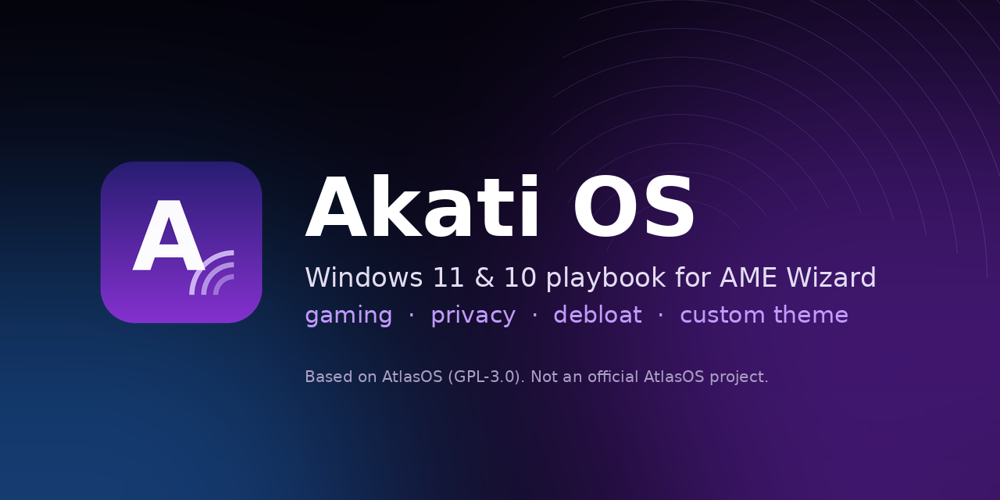
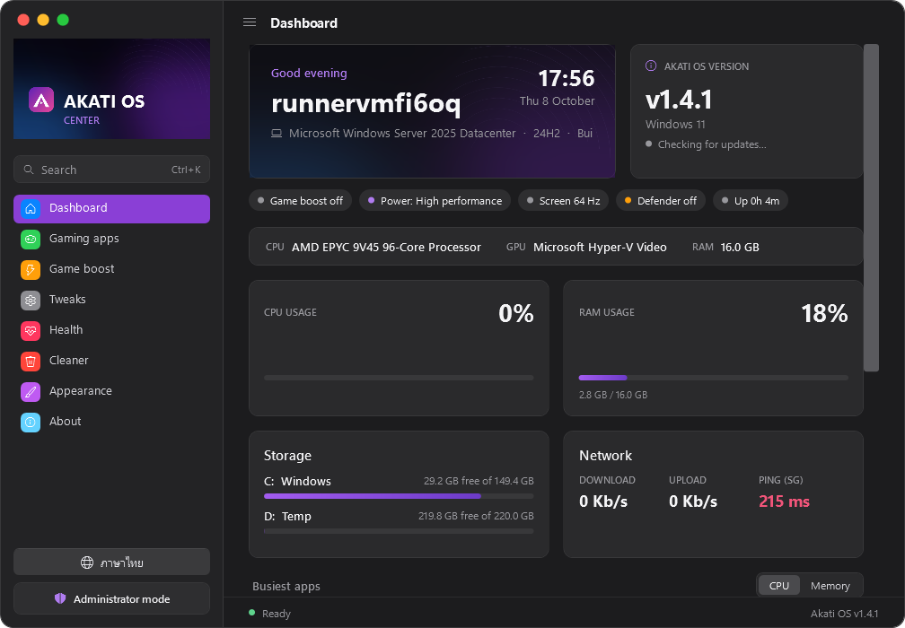
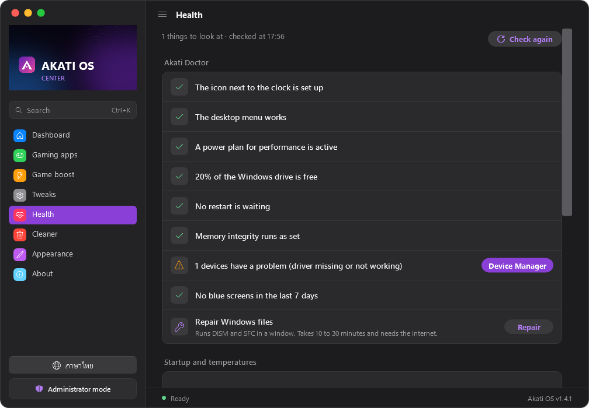
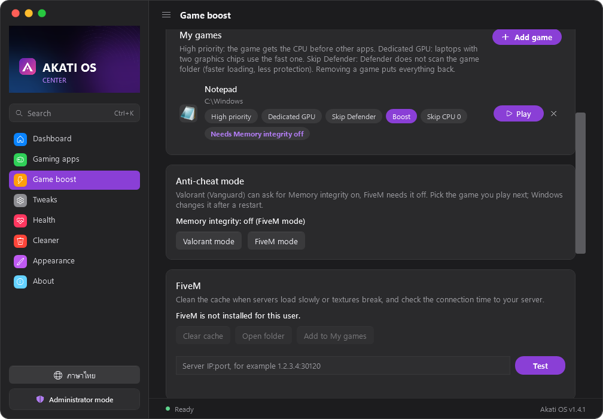
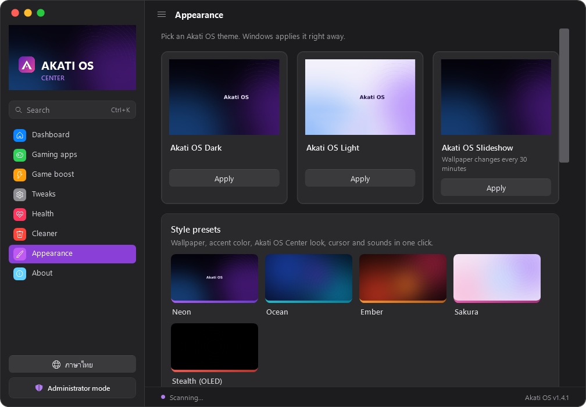
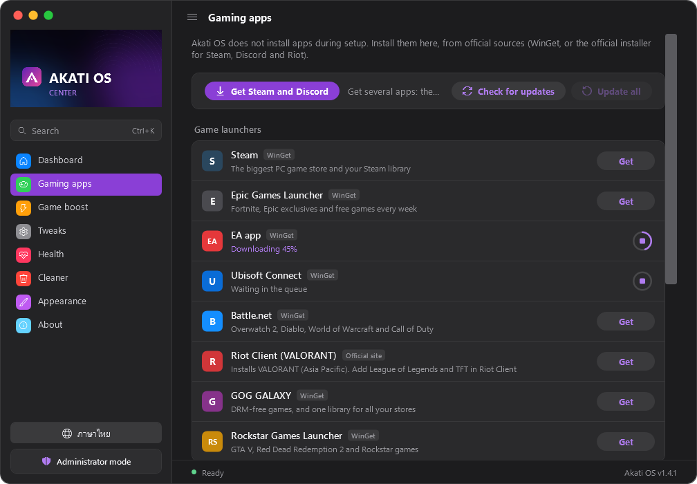
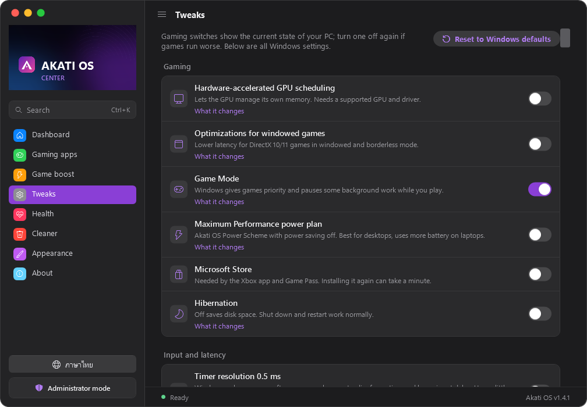

# Akati OS



Personal Windows 11 playbook for [AME Wizard](https://ameliorated.io), focused on gaming performance, privacy, debloat and a custom theme.

Akati OS is based on [AtlasOS](https://github.com/Atlas-OS/Atlas) v0.5.0 (Windows 11) and v0.4.1 (Windows 10), and is licensed under GPL-3.0. It is **not** an official AtlasOS project. Every change from AtlasOS is listed in [docs/CHANGES-FROM-ATLAS.md](docs/CHANGES-FROM-ATLAS.md).

> ⚠️ AME Wizard currently labels Akati OS as "Malicious". It is not meant to be: the full source is here and every change is listed in [docs/CHANGES-FROM-ATLAS.md](docs/CHANGES-FROM-ATLAS.md). Ameliorated is being contacted; see the release notes.

> ⚠️ Back up your files first. A playbook cannot be fully undone: to go back, reinstall Windows. Test in a virtual machine first.

## ภาษาไทย

Akati OS คือ playbook สำหรับ Windows 11 เน้นเล่นเกม ความเป็นส่วนตัว ลบแอปที่ไม่ใช้ และธีมของตัวเอง ดัดแปลงจาก AtlasOS v0.5.0 (GPL-3.0) ไม่ใช่โปรเจกต์ทางการของ AtlasOS

- โหลดไฟล์ `.apbx` จากหน้า [Releases](../../releases/latest) แล้วตรวจ SHA256 ก่อนใช้ (ดูวิธีด้านล่าง)
- Windows 11 ใช้ `AkatiOS-Win11_v<เวอร์ชัน>.apbx` ส่วน Windows 10 22H2 ใช้ `AkatiOS-Win10_v<เวอร์ชัน>.apbx` (Windows 10 หมดซัพพอร์ตแล้ว ถ้าลง Windows 11 ได้ให้ใช้ Windows 11)
- **สำรองไฟล์ก่อน** ย้อนกลับไม่ได้ทั้งหมด ถ้าจะกลับต้องลง Windows ใหม่
- ทดสอบใน VM ก่อนใช้กับเครื่องจริง ดู [docs/TESTING.md](docs/TESTING.md)
- ภาพหน้าจอดูที่หัวข้อ [Screenshots](#screenshots) เจอปัญหาให้เปิด [issue](../../issues/new/choose) แล้วแนบไฟล์จาก Akati OS Center > เกี่ยวกับ > **สร้างรายงานปัญหา**

### ไฟล์ไหนใช้กับ Windows อะไร

| | Windows 11 | Windows 10 |
|---|---|---|
| ไฟล์ | `AkatiOS-Win11_v<เวอร์ชัน>.apbx` | `AkatiOS-Win10_v<เวอร์ชัน>.apbx` |
| ชื่อใน AME Wizard | **AkatiOS11**, "Akati OS v<เวอร์ชัน> for Windows 11" | **AkatiOS10**, "Akati OS v<เวอร์ชัน> for Windows 10" |
| Windows ที่รองรับ | 24H2 (build 26100), 25H2 (26200), 26H2 (26300) | 22H2 (build 19045) เท่านั้น |
| ต้องลง Windows ใหม่ก่อน | แนะนำ | ต้อง (AME Wizard ตรวจ) |

เช็กเวอร์ชัน: กด Win+R พิมพ์ `winver` แล้วดู Version และ OS Build

- Windows ที่ถูกปรับแต่งมาแล้ว เช่น imOS 10 ก็ยังเป็น Windows 10 ใช้ไฟล์ Win10 (ยังไม่ได้ทดสอบเต็มรูปแบบ บางขั้นอาจไม่ผ่านเพราะ Windows ตัวนั้นลบบางส่วนออกไปแล้ว)
- ใช้ผิดไฟล์ AME Wizard จะขึ้น "Requirements not met: This Windows build is not supported by this Playbook" ไม่มีอะไรพัง ให้เปลี่ยนไปใช้ไฟล์ที่ถูก
- build อื่น เช่น Windows 10 21H2 (19044) หรือ Windows 11 23H2 (22631) ใช้ไม่ได้ทั้ง 2 ไฟล์

## Requirements

- Windows 11 24H2 (build 26100), 25H2 (build 26200) or 26H2 (build 26300): `AkatiOS-Win11_v<version>.apbx`
- Windows 10 22H2 (build 19045): `AkatiOS-Win10_v<version>.apbx`, see [Windows 10](#windows-10)
- Windows 11 26H1 (build 28000, for some new devices only) is not supported
- Internet connection during setup
- A valid Windows license (this playbook does not activate Windows)

## Features

- All AtlasOS performance, privacy and debloat tweaks
- Akati OS Dark, Light and Slideshow themes, wallpapers and lock screen (no AtlasOS logo)
- No apps are installed during setup: install them when you want from Akati OS Center. Optional (ticked by default): remove the Microsoft Store, turn off unused services (printing, search indexing, SuperFetch, network discovery, MSDTC), notifications and Xbox Game Bar, timer resolution 0.5 ms, the Sticky Keys shortcuts, an Akati OS desktop right-click menu and an icon next to the clock (free up RAM, your apps, Game boost and more, and Game boost that starts by itself with your games)
- Visual C++ and DirectX runtimes are always installed (from AtlasOS)
- **Akati OS Center** app, the one place for everything: install and update gaming apps (Steam, Epic Games Launcher, EA app, Ubisoft Connect, Battle.net, Riot Client, GOG GALAXY, Rockstar Games Launcher, Discord, OBS Studio, MSI Afterburner), GPU driver links, **Game boost** (one-click Game Mode, ping test, startup apps), gaming tweaks, cleaner, themes, accent colors, wallpapers, Akati OS cursor and sounds, live CPU/RAM/GPU usage, problem report, update check and **Tweaks** with every Windows setting in English and Thai
- Akati OS Slideshow theme and a Windows Terminal color scheme
- Defaults: Maximum Performance and Disable Hibernation are checked

## Screenshots

| Dashboard | Health (Akati Doctor) |
|---|---|
|  |  |
| **Game boost: My games and FiveM** | **Appearance: style presets** |
|  |  |
| **Gaming apps** | **Tweaks** |
|  |  |

Every page is also in Thai (one click on the language button). The CI renders these from the code (`AkatiCenter.ps1 -Screenshot`).

## Found a problem?

Open an [issue](../../issues/new/choose) and attach the problem report from Akati OS Center > About > **Create problem report** (one .zip on your desktop, no personal files).

## Install

1. Back up your files.
2. Download the `.apbx` for your Windows version and `SHA256SUMS.txt` from [Releases](../../releases/latest).
3. Check the hash in PowerShell. The value must match the line for your file in `SHA256SUMS.txt`:
   ```powershell
   (Get-FileHash .\AkatiOS-Win11_v1.5.0.apbx -Algorithm SHA256).Hash.ToLower()
   Get-Content .\SHA256SUMS.txt
   ```
4. Open AME Wizard and drag the `.apbx` file into it.
5. Follow the setup pages.

## Windows 10

`AkatiOS-Win10_v<version>.apbx` is a separate playbook for Windows 10 22H2 (build 19045). It is based on AtlasOS v0.4.1, the last AtlasOS version that supports Windows 10, and has the same Akati OS changes (themes, Akati OS Center, defaults; no Mica backdrop on Windows 10). Source: `src-win10/`.

> ⚠️ Microsoft ended support for Windows 10 on October 14, 2025, and Extended Security Updates for home users end on October 13, 2026. After that there are no security updates. Use the Windows 11 version if your PC can run Windows 11.

- Needs a fresh install of Windows 10 22H2 (AtlasOS v0.4.1 requirement)
- AtlasOS v0.4.1 is older than the base of the Windows 11 version and no longer gets fixes from the Atlas team

## Anti-cheat games

Some anti-cheat systems (for example Valorant Vanguard and FACEIT) need Defender, Core Isolation (VBS), TPM 2.0 or Secure Boot. Keep the recommended defaults if you play these games.

## Build from source

The Windows 11 playbook source is in `src/`, the Windows 10 one in `src-win10/`. Each `.apbx` file is a 7z archive (as the AME Wizard docs describe) of one of them with the password `malte` (the AME Wizard default). From the repository root:

```
.\build.ps1     # Windows, needs 7-Zip (winget install 7zip.7zip)
./build.sh      # Linux/macOS, needs 7-Zip (7z, 7zz or 7za)
```

The output is `dist/AkatiOS-Win11_v<version>.apbx`, `dist/AkatiOS-Win10_v<version>.apbx` and `dist/SHA256SUMS.txt`.

Every push also builds the playbook on GitHub Actions. The `.apbx` is under **Artifacts** on the run page.

## Release (maintainer)

1. Update the version everywhere, in **both** `src/` and `src-win10/`: `playbook.conf` (`Title`, `Version`), `Configuration/tweaks/misc/config-oem-information.yml` (`$version`), `CREDITS.txt`, `README.md`, a new `## v<version>` section in `CHANGELOG.md`, and the root `README.md`. CI stops the release if they do not match.
2. Run the checklist in [docs/TESTING.md](docs/TESTING.md).
3. Merge to `main`, then tag and push:
   ```
   git tag v1.5.0
   git push origin v1.5.0
   ```
   Or without git: Actions > Build playbook > Run workflow, branch `main`, tick **Publish release**.
4. GitHub Actions checks the versions, builds both `.apbx` files and publishes the release with `SHA256SUMS.txt`. Release notes come from `src/CHANGELOG.md`.

## Documentation

- [docs/OPTIONS.md](docs/OPTIONS.md): what each setup option does (English and Thai)
- [docs/TESTING.md](docs/TESTING.md): VM test checklist (Windows 11 24H2, 25H2, 26H2 and Windows 10 22H2)
- [docs/CHANGES-FROM-ATLAS.md](docs/CHANGES-FROM-ATLAS.md): every change from AtlasOS and what `GAMEAPPS.ps1` downloads
- [src/CHANGELOG.md](src/CHANGELOG.md) and [src-win10/CHANGELOG.md](src-win10/CHANGELOG.md): changes per version

## License and credits

GPL-3.0, see [LICENSE](LICENSE). Source of this modified version must stay available.

- [AtlasOS](https://github.com/Atlas-OS/Atlas) team, for the base playbook (GPL-3.0)
- [Ameliorated](https://ameliorated.io), for AME Wizard
